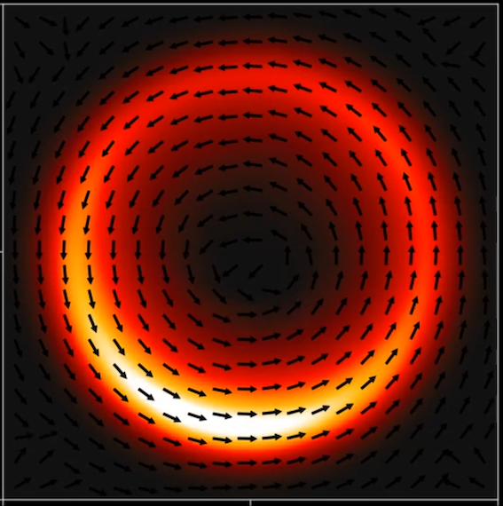

# SOH.jl : Self Organized Hydrodynamics PDE solver in Julia

<p align="center">

</p>


This (small) package is a finite volume solver for the Self-Organized Hydrodynamics (SOH) partial differential equation system derived as the macroscopic limit of a Vicsek-like model by P. Degond and S. Motsch in 

[1] P. Degond, S. Motsch. *Continuum limit of self-driven particles with orientation interaction*, Math. Models Methods Appl. Sci., Vol. 18, Suppl., pp. 1193-1215, (2008).

The implementation is based on the methodology developed by S. Motsch and L. Navoret in 

[2] S. Motsch, L. Navoret, *Numerical simulations of a non-conservative hyperbolic system with geometric constraints describing swarming behavior*, Multiscale Model. Simul., Vol. 9, No. 3, pp. 1253–1275, (2011).

The Fortran package [Vicsek_macro](https://github.com/smotsch/Vicsek_macro) is an earlier version of this solver implemented by S. Motsch.


## Installation 

This package can be installed globally using the Julia package manager by typing

```julia
] add ...
```

Alternatively, it is also possible to clone the GitHub repository and to run a simulation as explained in the example script ``example.jl``. 

## The SOH model

The SOH model is a continuum version of the interacting particle system, originally introduced by Vicsek et al. in 

[3] T. Vicsek, A. Czirók, E. Ben-Jacob, I. Cohen, O. Shochet, *Novel type of phase transition in a system of self-driven particles*. Phys. Rev. Letr., Vol. 7, No. 6, pp. 1226, (1995),

and further developed in [1]. This model is based on an alignment mechanism which tends the relax the direction of motion of each particle towards the average direction of motion of its neighbours. The particles are assumed to be self-propelled and to move at a constant speed which is a specificity of the Vicsek mdel. 

The SOH partial differential equations system reads 

∂ₜ ρ + c₁∇ₓ⋅(ρΩ) = 0

ρ(∂ₜ Ω + c₂(Ω⋅∇ₓ)Ω) + λP(Ω)(∇ₓρ + ρ∇ₓV) = 0,

where $\rho\equiv\rho(t,x)$ represents the density of particles and $\Omega \equiv \Omega(t,x)$ is the velocity field at time $t$ and at a position $x$. The constant speed constraint is preserved thanks to the operator $P_{\Omega^\perp} = \mathrm{Id} - \Omega\otimes\Omega$ which is the projection operator on the orthogonal of the vector $\Omega$. It ensures that, for all $(t,x)$, 

$$|\Omega(t,x)|=1,$$

provided that it holds at initial time. 

The coefficient $c_1,c_2$ and $\lambda$ are given in [1] by

$$
\begin{align*}
c_1 &= \int_0^\pi \cos\theta \, M(\theta)\,\mathrm{d}\theta, \\
c_2 &= \frac{\int_0^\pi \cos\theta\,\sin\theta\,g(\theta)\,M(\theta)\,\mathrm{d}\theta}{\int_0^\pi \sin\theta\,g(\theta)\,M(\theta)\,\mathrm{d}\theta},\\
\lambda &= \frac{1}{\kappa}, \\
M(\theta) &= \frac{\mathrm{exp}(\kappa\cos\theta)}{\int_0^\pi \mathrm{exp}(\kappa\cos\theta')\,\mathrm{d}\theta}.
\end{align*}
$$

The parameter $\kappa>0$ is a concentration parameter which defines the strength of the alignment between the particles and $g(\theta)$ is a so-called *Generalized-Collision Invariant* whose expression can be found in [1,2]. The case $g(\theta)=1$ corresponds to a different alignment mechanism introduced in 

[4] G. Dimarco, S. Motsch, *Self-alignment driven by jump processes: Macroscopic limit and numerical investigation*, Math. Models Methods Appl. Sci., Vol. 26, No. 7, pp. 1385–1410, (2016). 


## Numerical method

The implementation is based on the methodology introduced by [2]. When $V=0$, the SOH model is shown to be the formal relaxation limit $\varepsilon\to0$ of a conservative system:

$$
\begin{align*}
&\partial_t\rho^\varepsilon + c_1\nabla_x\cdot(\rho^\varepsilon\Omega^\varepsilon) = 0\\
& \partial_t(\rho^\varepsilon\Omega^\varepsilon) + c_2\nabla_x\cdot(\rho^\varepsilon\Omega^\varepsilon\otimes \Omega^\varepsilon) + \lambda\nabla_x\rho^\varepsilon = \frac{\rho^\varepsilon}{\varepsilon}\big(1-|\Omega^\varepsilon|^2\big)\Omega^\varepsilon.
\end{align*}
$$

Following this idea, the Finite Volume scheme is based on a splitting method described by the following steps: 

1. Solve the conservative part 

$$
\begin{align*}
&\partial_t\rho + c_1\nabla_x\cdot(\rho\Omega) = 0\\
& \partial_t(\rho\Omega) + c_2\nabla_x\cdot(\rho\Omega\otimes \Omega) + \lambda\nabla_x\rho = 0,
\end{align*}
$$

which is a classical 2D Euler system (with coeffcients $c_1\ne c_2$). Using a dimensional splitting method as described in Section 19.5 of 

[5] R. J. LeVeque, *Finite volume methods for hyperbolic problems*, Cambridge university press, 2004, ISBN 0-511-04219-1, 

this reduces to solving two 1D Euler systems. The present package implements a Roe scheme as in the package [Vicsek_macro](https://github.com/smotsch/Vicsek_macro) as well as a more stable positivity preserving HLLE scheme described in [5, Section 15.3.7] and introduced in 

[6] B. Einfeldt, C. D. Munz, P. L. Roe, B. Sjögreen, *On Godunov-type methods near low densities*, J. Comput. Phys., Vol. 92, No.2, pp. 273-295, (1991).

2. The relaxation part reduces to 

$$
\begin{align*}
&\partial_t\rho = 0\\
& \partial_t(\rho\Omega) = \frac{\rho}{\varepsilon}\big(1-|\Omega|^2\big)\Omega.
\end{align*}
$$

It can be solved explicitly $|\Omega|^2 = (1+C_0\mathrm{e}^{-2/\varepsilon t})^{-1}$ with $C_0 = (\frac{1}{|\Omega_0|^2}-1)$. Numerically, taking the limit $\varepsilon\to0$ yields to a mere normalization 

$$\Omega^{n+1} = \frac{\Omega^n}{|\Omega^n|}.$$

3. Using again a fractional splitting [5, Section 17.1], the source terms reduces to 

$$
\begin{align*}
&\partial_t\rho = 0\\
& \partial_t\Omega = \lambda P_{\Omega^\perp} F, \quad F = -\nabla_x V.
\end{align*}
$$

This part can also be solved explitly in dimension 2, namely $\Omega(t) = (\cos\theta,\sin\theta)^\mathrm{T}$ where 

$$\theta = \psi + 2\,\mathrm{atan}(C_0\mathrm{e}^{-\lambda|F|t}),$$

where $F = |F|(\cos\psi,\sin\psi)^{\mathrm{T}}$ and $C_0 = \tan(\frac{\theta_0-\psi}{2})$. 

Finally, at each step, the boundary conditions are treated using the ghost cells method described in [5, Chapter 7]. The boundary conditions currently implemented are periodic, Neumann and reflecting boundary conditions. 

## Example 

The typical workflow to run a simulation is described in the example script ``example.jl`` which can be launched by typing 

```julia
include("example.jl)
```

This script defines some simulation parameters and runs the main function `run!` (defined in the script `run.jl`). In addition to running the simulation, this function also creates a new directory in the current directory and save at least the initial and final data and possibly the plots or a video. All the plots and videos are produced using the [Makie.jl](https://makie.juliaplots.org/stable/) package. The data are saved using the [JLD2](https://github.com/JuliaIO/JLD2.jl) package.  

In the example script, the density is initially uniform and the velocities are uniformly randomly sampled. The system is subject to reflecting boundary conditions and to a confining radial potential in a disk, namely the potential is $V(r) = 0$ for $r<r_0$ and $V(r) = \frac{C}{2}(r-r_0)^2$ for $r>r_0$. It leads to a final steady milling behavior, see for instance 

[7] P. Degond, H. Yu, *Self-organized hydrodynamics in an annular domain: Modal analysis and nonlinear effects*, Math. Models Methods Appl. Sci., Vol. 25, No. 3, pp. 495–519, (2015).

## Benchmark

On a grid of size $400\times400$, one iteration takes less than 0.1 seconds of CPU time on an Intel MacBook Pro (2GHz Intel Core i5 processor with 8GB of memory). With this configuration, it takes about 15 minutes to run the example script. It is slighlty more performant (about 50% faster) than the Fortran implementation. It is comparable to the simulation time of a system of 100k particules on a CPU or with several millions of particles on a GPU, both using the high-performance [SiSyPHE](https://github.com/antoinediez/Sisyphe) library. 

**Note:** currently, a significant computational time is necessary to save plots or to produce a video. Better performances (about two times faster) are achieved when no plots are generated. 


